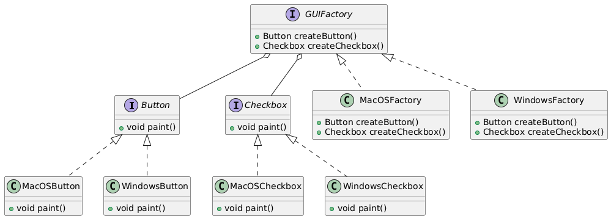

# Cross Platform GUI Factory

## 📖 The Story Behind the Problem

Imagine building a cross-platform application that can run on both MacOS and Windows. Each platform requires different UI elements (like Buttons and Checkboxes) with distinct behavior and appearance.

The challenge is:

* How do we create platform-specific components (Buttons, Checkboxes, etc.) without duplicating code?
* How can we easily switch between different product families (like MacOS vs Windows) without rewriting logic?

The Abstract Factory Pattern solves this by allowing the creation of related objects (Button, Checkbox) without specifying their concrete classes in your core logic.

## 💡 Solution

The Abstract Factory Pattern provides a way to encapsulate a group of related objects (such as MacOS buttons and checkboxes) into a single factory object. Each platform (MacOS, Windows) gets its own factory class to produce the appropriate components.

Practical Flow in This Example:
1. Abstract Interfaces:
    * Button and Checkbox define common behavior for platform-specific products.
2. Concrete Products:
   * MacOSButton and WindowsButton implement the Button interface.
   * MacOSCheckbox and WindowsCheckbox implement the Checkbox interface.
3. Factories:
   * GUIFactory defines methods for creating both buttons and checkboxes.
   * MacOSFactory and WindowsFactory implement the GUIFactory interface to produce platform-specific objects.

This approach abstracts the creation logic and allows you to easily switch between MacOS and Windows components.

## 🛠️ UML Diagram

## 🎯 What We Achieve

* Single Responsibility Principle: Each factory class (MacOSFactory, WindowsFactory) is responsible only for creating related UI components.
* Open/Closed Principle: You can add new product families (like Linux components) by creating new factory classes without changing existing code.
* Platform Independence: The client code remains independent of specific product implementations (MacOS vs Windows).
* Easier Maintenance: Changes to specific product logic are isolated to their respective classes, reducing the risk of bugs.
