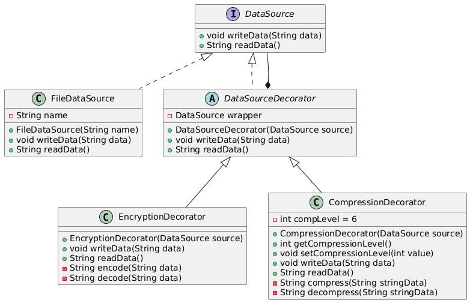

# Encoding and Compression

## 📖 The Story Behind the Problem

Imagine a system where you need to store sensitive data (like employee salary records). However, directly saving this data is risky:

* Sensitive data needs to be encrypted for security.
* Large datasets should be compressed to save storage space.

A simple solution might involve modifying the existing FileDataSource class to handle encryption and compression. However, this leads to several problems:

* Violation of the Single Responsibility Principle: The FileDataSource class would have to manage both data storage and processing (encryption/compression).
* Hard to maintain: If new features (like data hashing or logging) are required, the class will become more complex.
* Limited flexibility: You might want to apply encryption and compression selectively. If everything is built into one class, it’s harder to control how these operations are applied.
To overcome these issues, the Decorator Design Pattern provides a better solution by adding responsibilities to objects dynamically without modifying their code.

## 💡 Solution

The Decorator Design Pattern allows us to attach additional functionality to an object at runtime by wrapping it in decorator classes. In this example:

* The FileDataSource class is responsible for reading and writing files.
* Decorators (like EncryptionDecorator and CompressionDecorator) add new behavior dynamically. These decorators wrap the data source and apply encryption or compression as needed.
* Multiple decorators can be combined. For example, you can first encrypt the data, then compress it, and finally store it in the file.

This approach keeps the original FileDataSource class simple and focused while giving the flexibility to extend its behavior without modifying it.

Practical Flow in This Example:
* The FileDataSource stores data in a file.
* The EncryptionDecorator encrypts the data before writing it to the file and decrypts it when reading.
* The CompressionDecorator compresses the encrypted data before storing it and decompresses it when reading.
* Multiple decorators can be stacked in any order.

## 🛠️ UML Diagram

## 🎯 What We Achieve

* Single Responsibility Principle: Each class has only one responsibility (e.g., FileDataSource stores data, EncryptionDecorator handles encryption).
* Flexible Composition: Decorators can be stacked in any order, allowing different combinations of behaviors.
* Extensibility: New decorators can be added easily without changing existing code.
* Runtime Behavior Modification: You can wrap an object in decorators dynamically, even during runtime, based on conditions.

## ⚠️ Cons of This Solution

* Complexity: Adding multiple decorators can make the code harder to understand, especially if many are nested.
* Debugging Issues: Tracking data through multiple layers of decorators can become challenging.
* Performance Overhead: Wrapping objects in many decorators adds some performance overhead, especially if heavy operations (like encryption or compression) are involved.
