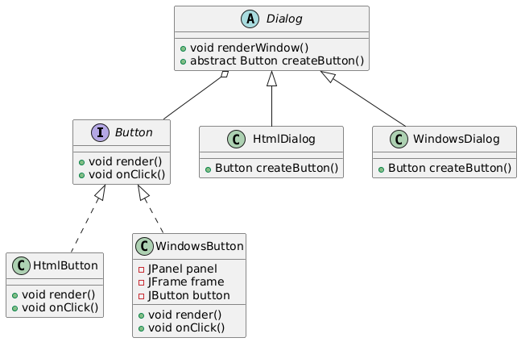

# Cross Platform GUI Elements

## 📖 The Story Behind the Problem

Imagine you are developing an application that runs on multiple platforms:

* Web browsers (using HTML buttons)
* Desktop environments (using native Windows buttons)

Each platform requires different button implementations, but your application logic should remain the same. The challenge is:

* How do we avoid changing the core logic every time we need to support a new platform?
* How do we ensure code reusability and consistency while providing platform-specific button objects?

The Factory Method Design Pattern helps solve this problem by defining a way to create objects (buttons in this case) without needing to specify the exact class.

## 💡 Solution

The Factory Method Pattern suggests that instead of directly instantiating platform-specific objects, we should define an interface (or abstract class) for the common type (Button) and let subclasses decide which specific implementation to create.

Practical Flow in This Example:
* Dialog class is an abstract class with the renderWindow() method that calls the createButton() factory method.
* The subclasses (HtmlDialog and WindowsDialog) override the factory method to create platform-specific buttons (HtmlButton or WindowsButton).
* When the dialog renders, the correct button type is created dynamically without changing the core rendering logic.

## 🛠️ UML Diagram

## 🎯 What We Achieve

* Single Responsibility Principle: The Dialog class focuses on rendering the window, while the creation of buttons is delegated to specific dialog subclasses.
* Open/Closed Principle: Adding a new button type (for example, a Mac button) can be done by creating a new dialog subclass without modifying the existing code.
* Code Reusability: The rendering logic in Dialog stays the same across all platforms, improving consistency and reuse.
* Scalability: This pattern makes the code more adaptable to changes since we can easily add new products without touching the core logic.

## ⚠️ Cons of This Solution

* More Complexity: The introduction of multiple subclasses and factory methods can increase the code complexity for simple use cases.
* Harder to Debug: The creation logic is spread across different classes, which might make it harder to trace when new developers join the project.
* Tight Coupling between Factories and Products: Each factory class (e.g., HtmlDialog, WindowsDialog) is tightly coupled with its product type, which can be cumbersome if product variations become too complex.
