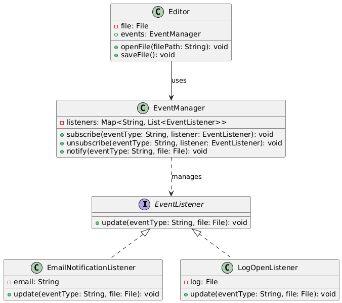

# Event Subscription (File Editor)

## 📖 The Story Behind the Problem
Imagine you are building a text editor application where users can open and save files. Now, you want to notify other components (like sending an email notification or logging events) whenever a user opens or saves a file.

Initially, you might think of directly calling these components from the Editor class, but that introduces several problems:

* The Editor class becomes tightly coupled with specific notification and logging systems.
* Adding new types of notifications (e.g., push notifications) will require changing the Editor class.
* It becomes hard to maintain and extend the system over time.

To solve these issues, we need a way for the Editor to notify multiple components without directly depending on them. This is where the Observer Design Pattern comes in.

## 💡 Solution

The Observer Pattern allows us to decouple the Editor class from the components that need to be notified (observers). With this pattern:

* The Editor class only knows it needs to notify some observers about file events, but it doesn’t care which observers they are.
* Observers (like EmailNotificationListener or LogOpenListener) subscribe to the EventManager. Each time an event occurs (e.g., a file is opened or saved), the EventManager notifies all subscribed listeners.
* New observers can be added easily without modifying the Editor or EventManager class.

Here’s how it works in practice:

* EventManager keeps track of the observers for different event types (e.g., "open" and "save").
* Observers (EmailNotificationListener and LogOpenListener) subscribe to events they are interested in.
* When the editor opens or saves a file, the EventManager notifies all the relevant observers.

## 🛠️ UML Diagram

## 🎯 What We Achieve

* Loose Coupling: The Editor class doesn’t need to know the details of notification systems.
* Scalability: Adding new observers is easy and requires no changes to existing code.
* Flexibility: Observers can be subscribed or unsubscribed dynamically at runtime.
* Better Code Organization: The EventManager handles subscriptions and notifications, keeping responsibilities clear and separated.

## ⚠️ Cons of This Solution

* Complexity: Managing subscriptions and notifications adds some complexity, especially in larger systems.
* Potential Overhead: If many observers are registered, the notification process can slow down.
* Memory Leaks: Forgetting to unsubscribe listeners can lead to memory leaks in long-running applications.
