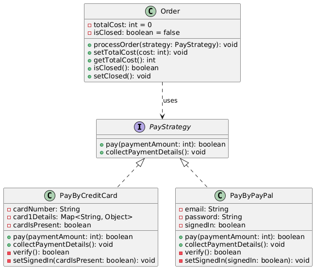

# Payment System

## 📖 1. The Story Behind the Problem
Imagine you are building an online store where customers can pay using either a **Credit Card** or **PayPal**. Each payment method has its own unique steps.

Initially, you decide to hardcode the payment logic into the Order class. But soon you realize:

* What happens if you want to add more payment methods in the future?
* Modifying the `Order` class each time is messy and error-prone.
* It becomes harder to maintain and test the code as the project grows.
* The code violates the **Open/Closed Principle**, meaning it is not open to easy extension without modifying the original class.

## 💡 Solution
To avoid these problems, we use the Strategy Design Pattern. Here’s how it works practically:

* **Separate Payment Logic from the Order Class:**
Instead of embedding the payment logic in `Order`, we move it into strategy classes. Each strategy handles one specific payment type.

* **Use a Common Interface (`PayStrategy`):**
All payment strategies (like Credit Card and PayPal) implement a common interface. This interface defines two methods:

  * `pay(int amount)`: Handles the payment process.
  * c`ollectPaymentDetails()`: Gathers necessary information from the user.
* **`Order` Class Only Knows the Strategy Interface:**
The `Order` class only needs to know that it has to process a payment using some strategy, but it doesn’t care which one. This makes it easy to switch between payment methods without changing the `Order` class.

* **Practical Example:**

  * When a user chooses **Credit Card**, the `Order` class uses the `PayByCreditCard` strategy. This strategy will ask for the card number, expiry date, CVV, and PIN.
  * If the user selects **PayPal**, the `Order` class will switch to the `PayByPayPal` strategy, which asks for the user’s email and password.

🛠️ 3. UML Diagram

## 🎯 What We Achieve
* **Cleaner Code:** Payment logic is separated from the main order logic, making the code easier to read and manage.
* **Easy to Add New Payment Methods:** Adding a new payment method (like Google Pay) is as simple as creating a new strategy class without touching the existing code.
* **Flexible and Reusable:** The same payment strategies can be reused across different parts of the system or projects.
* **Better Testing:** Each strategy can be tested individually, making the system more reliable.

## ⚠️ Cons of This Solution
* **More Classes to Manage:** Each payment method requires a separate strategy class, which can increase the number of classes in the project.
* **Learning Curve:** Developers unfamiliar with the Strategy Pattern may need some time to understand and implement it correctly.
* **Slight Overhead:** Switching between strategies adds a little overhead, but it’s negligible for most applications.